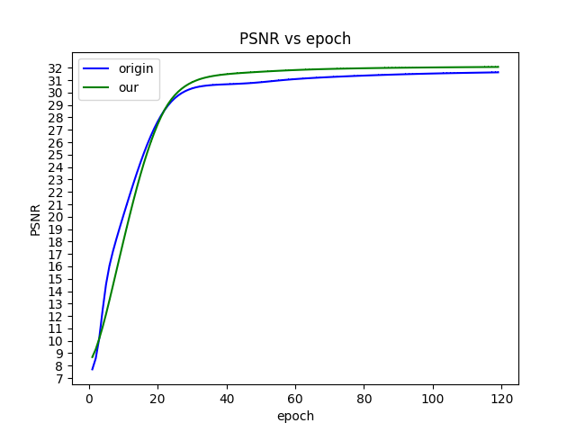

### 📖 Edge-enhanced super-resolution reconstruction of rock CT images

Chennian Gao and Chen Qiu,  Wuhan University of Science and Technology


---
### Requirements
> - Python 3.8, PyTorch >= 1.11
> - BasicSR 1.4.2
> - Platforms: Ubuntu 18.04, cuda-11

### Installation
```
# Clone the repo
git clone https://github.com/gao131/Edge_SAFMN.git
# Install dependent packages
cd Edge_SAFMN
pip install -r requirements.txt
# Install BasicSR
python setup.py develop
```
You can also refer to this [INSTALL.md](https://github.com/XPixelGroup/BasicSR/blob/master/docs/INSTALL.md) for installation

### Training
Run the following commands for training:
```
python basicsr/train.py -opt options/train/Edge_SAFMN/train_x4.yml
```
The following figure shows the changes in PSNR values on the validation set for the original SAFMN model and the proposed improved model with a downsampling factor of 4. Although both models continue to rise slowly after 100 epochs, their performance has largely stabilized. Due to time and computational resource constraints, experiments were conducted at epoch 100. During training, both models used a learning rate of 1e-4.



### Testing 

- Download the pretrained models, you can download the pretrained model from [checkpoint](https://drive.google.com/drive/folders/1oL4Y17Fw0zNu_Njqfhw6MvGCAI-u4VRe?usp=drive_link).
- Download the testing dataset, you can download simple test data for testing through the [test dataset](https://drive.google.com/drive/folders/1j3Rf0evsKg84loUAkbftNDB4gr0Mnvq5?usp=drive_link).
- Run the following commands:
```
python basicsr/test.py -opt options/test/Edge_SAFMN/test_x4.yml
```

### Acknowledgement
This code is built on [SAFMN](https://github.com/sunny2109/SAFMN) .

